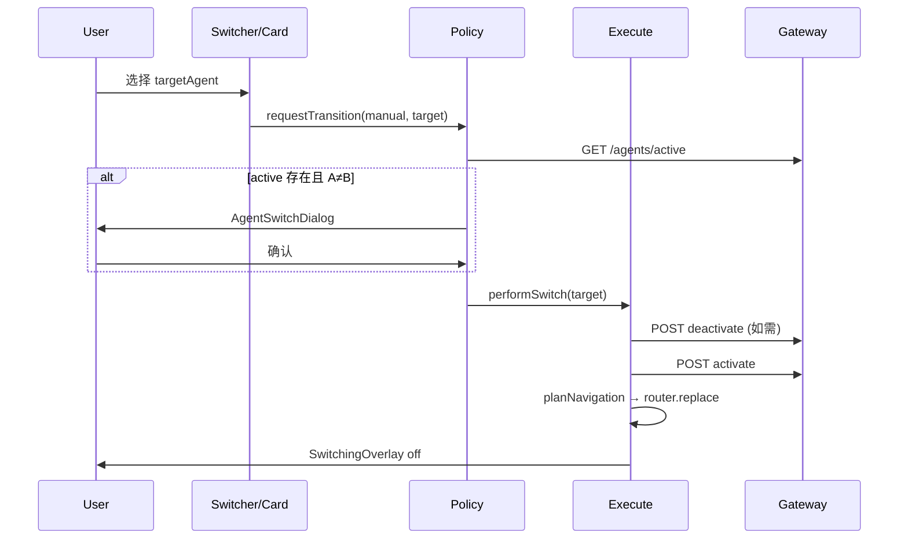
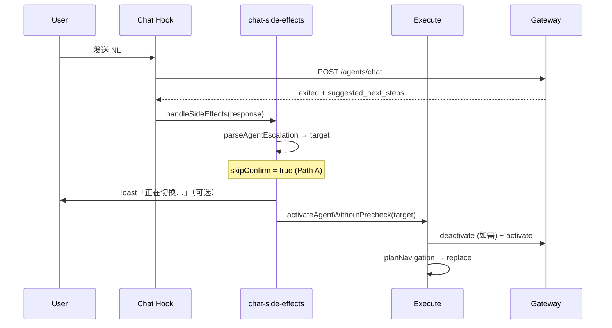

# Agent Transition FE SDD v1.1

**Jira:** KAZI-124  
**日期:** 2026-07-10  
**状态:** Draft — **待 Review，Review 通过后再写代码**  
**代码库:** kazispace-ai（FE only）  
**产品 / BE SSOT:** [agent-switching-ux-v1.0.md](https://github.com/Kazispace/kazispace-design/blob/main/docs/architecture/agent-switching-ux-v1.0.md)（[design #305](https://github.com/Kazispace/kazispace-design/pull/305)）  
**上一版:** [agent-transition-fe-v1.0.md](./agent-transition-fe-v1.0.md)

---

## Executive Summary（本 PR 重点）

本 SDD 定义 **FE 侧 Agent 切换的统一方案**，核心解决两类问题：

1. **手动切换（Path B）** — 用户在 UI 上主动选择专家，完成 **门诊（Clinic）↔ 子 Agent**、**子 Agent ↔ 子 Agent** 跳转。  
2. **统一 Execute 管道** — 无论手动、NL 自动（Path A）还是待确认（Path C），最终都走同一条 `deactivate → activate → navigate → hydrate` 链；差异只在 **入口** 与 **是否 confirm**。

```
                    ┌──────────────────────────────────────┐
                    │         FE Unified Execute           │
                    │  planNavigation + performSwitch      │
                    └──────────────────────────────────────┘
                           ▲              ▲
              ┌────────────┘              └────────────┐
              │ 手动 Entry (Path B)      Chat Entry (A/C) │
              │ Switcher / 卡片 / 面包屑   agents/chat 响应 │
              └──────────────────────────────────────────┘
```

**手动切换是本 PR 的设计重心**：补齐 Hub 页（CV / Interview / English）与 Clinic 一致的 Switcher、确认框、Layer 面包屑；自动切换在 §5 简述，实现排在 Phase 3。

---

## 0. 设计原则（Review 重点）

1. **触发源与执行链分离**  
   - **谁决定切换**（UI 点击 vs BE/LLM 意图）与 **怎么切换**（deactivate → activate → navigate → hydrate）是两件事。  
   - FE 只允许 **一条 Execute 管道**；不同触发源只在 **入口策略**（是否 confirm、是否展示 Switcher）上不同。

2. **手动 ≠ 自动，不可混写**  
   - 手动切换：**用户未发 NL 意图**，通过 Switcher / 卡片 / 面包屑等 UI 明确选目标专家。  
   - 自动切换：**用户发了 chat**，BE Gateway 经 LLM/规则判定后，在 `agents/chat` 响应里带回切换信号；FE **不得**在客户端自行猜测意图并 activate。

3. **Confirm 是第三态（BE 触发 + FE 确认）**  
   - 意图模糊时 BE 返回 `pending_transition`；FE 弹确认框，用户点确认后才走 Execute。  
   - 这不属于「纯手动」，也不属于「纯自动链式切换」。

4. **Review 通过前不合并实现 PR**  
   - 分支上已有的 Phase 0 实验代码（`agent-transition/*`、`AgentTransitionProvider`）视为 **草案**，以本 SDD 为准对齐或回滚。

---

## 1. 背景

### 1.1 Surface 模型

```
Clinic /chat          — 门诊壳；in-clinic 专家（job_search …）在同页渲染
Hub /cv|interview|english — 独立页面壳；cv_builder / mock_interview / english_tutor
```

### 1.2 为什么要分「手动 / 自动」

| 维度 | 手动切换（UI） | 自动切换（BE/LLM） |
|------|----------------|-------------------|
| **触发** | 用户点 UI | 用户发 chat，BE 判定意图 |
| **决策方** | 用户选 `targetAgentId` | BE 返回 `suggested_next_steps` 或 `pending_transition` |
| **Confirm** | 有 active 冲突时需 Path B 确认 | Path A 跳过；Path C 必须确认 |
| **UI** | Switcher、Layer 面包屑、卡片 | 无 Switcher；可选 Toast / read-only banner |
| **典型入口** | `+`、Welcome 卡片、Referral 接受 | 「帮我写简历」「帮我练习面试」 |

现状问题：上述两条路径在 `clinic-shell`、`use-cv-agent`、`agent-escalation` 各自实现，导致 **同类切换有时成功有时失败**（例如 CV 页 NL escalation 未导航）。

### 1.3 手动切换：门诊 ↔ 子 Agent 场景矩阵

「主 Agent」= **Clinic 门诊层**（`/chat`，无 expert 或 in-clinic expert）；「子 Agent」= **Dedicated Hub 专家**（独立路由页）或 **in-clinic expert**（同页渲染）。

| 用户操作（手动） | 从 | 到 | 导航 | Confirm |
|------------------|----|----|------|---------|
| Clinic `+` → job_search | Clinic | in-clinic | 无（同页） | 有 active 时 |
| Clinic 卡片 → CV | Clinic | cv_builder | `replace /cv` | 有 active 时 |
| Hub `+` → Interview | cv_builder | mock_interview | `replace /interview` | 有 active 时 |
| Hub `+` → job_search | cv_builder | job_search | `replace /chat` | 有 active 时 |
| Hub 面包屑 → 门诊 | 任意 Hub | Clinic | `replace /chat` | 无（exit） |
| Clinic Layer → 门诊 | in-clinic | Clinic | 无 | 无（exit） |

**统一规则：** 跨 Surface 必 `replace`；Execute 前若 server active ≠ target 且未 exit，弹 `AgentSwitchDialog`。

---

## 2. 术语与路径编号

### 2.1 用户视角（推荐对外说法）

| 名称 | 含义 |
|------|------|
| **手动切换** | UI 发起，用户明确选择目标专家 |
| **自动切换** | Chat 发送后，BE 判定应切换，FE 消费响应并执行 |
| **待确认切换** | BE 认为可能切换，FE 弹窗让用户确认（Path C） |

### 2.2 工程路径（与 BE 文档对齐）

| 路径 | 触发源 | BE 响应字段 | FE Confirm |
|------|--------|-------------|------------|
| **Path B — 手动** | UI | （无 chat 响应；FE 直接调 activate） | 有 active 且 A≠B 时 **必须** |
| **Path A — 自动 escalation** | Chat | `exited: true` + `suggested_next_steps[]` | **跳过**（NL 即意图） |
| **Path C — 待确认** | Chat | `pending_transition.kind === 'switch'` | **必须**（专用 Dialog） |

> Path A / C 均属于「Chat 触发」家族；Path B 属于「UI 触发」家族。

---

## 3. 总架构

### 3.1 分层

```
┌─────────────────────────────────────────────────────────────┐
│  Entry Layer（按触发源分叉）                                  │
│  · ManualEntry   — Switcher / 卡片 / 面包屑回门诊             │
│  · ChatSideEffects — 解析 chat 响应（Path A / C / 普通 reply）│
└───────────────────────────┬─────────────────────────────────┘
                            │ TransitionIntent { target, trigger, skipConfirm? }
                            ▼
┌─────────────────────────────────────────────────────────────┐
│  Policy Layer（Confirm 策略）                                │
│  · manual  → needsExplicitSwitchConfirm(active, target)      │
│  · auto A  → skipConfirm = true                              │
│  · pending C → store pending → AgentSwitchDialog             │
└───────────────────────────┬─────────────────────────────────┘
                            ▼
┌─────────────────────────────────────────────────────────────┐
│  Execute Layer（唯一 SSOT） runAgentTransition / performSwitch │
│  precheck → deactivate → activate → planNavigation → hydrate │
└─────────────────────────────────────────────────────────────┘
```

### 3.2 模块职责（目标态）

| 模块 | 职责 | 手动 | 自动 |
|------|------|------|------|
| `surfaces.ts` | Agent ↔ Surface 注册 | ✓ | ✓ |
| `navigation.ts` | `planNavigation` 矩阵 | ✓ | ✓ |
| `orchestrator.ts` | Execute 管道 | ✓ | ✓ |
| `chat-side-effects.ts` | 解析 `agents/chat` 响应 | ✗ | ✓ |
| `AgentTransitionProvider` | Overlay + **手动** Switcher/Dialog | ✓ | 仅复用 Dialog（Path C / B） |
| `HubLayerBar` | Hub 手动入口 + 回门诊 | ✓ | ✗ |

**关键约束：** `chat-side-effects` **不得**调用 Switcher；`HubLayerBar` **不得**解析 escalation。

### 3.3 FE 统一方案 — 模块与 API（目标态）

```
src/lib/agent-transition/
  types.ts              AgentSurfaceId, TransitionIntent, NavigationPlan
  surfaces.ts           resolveSurfaceForAgent(), getSurfacePath()
  navigation.ts         planNavigation()          ← 导航 SSOT
  orchestrator.ts       runAgentTransition()      ← Execute SSOT

src/hooks/
  use-agent-transition.ts    React 薄包装（fromSurface + navigate 上下文）

src/components/agent-transition/
  agent-transition-provider.tsx   手动 UI：Switcher + Dialog + Overlay
  hub-layer-bar.tsx               Hub 手动入口（Layer + `+`）
```

**统一入口约定：**

| API | 用途 | 触发 |
|-----|------|------|
| `requestAgentSwitch(agentId)` | 手动切换（含 precheck + confirm） | Path B |
| `activateAgentWithoutPrecheck(agentId)` | 跳过 precheck 的 Execute | Path A、Path C 确认后 |
| `returnToClinic()` | 手动回门诊 | 面包屑 / Back |
| `planNavigation(locale, fromSurface, target)` | 决定是否 `replace` 及 href | Execute 内 |

**`fromSurface` 上下文：** 每个 Surface 页面注入 `{ fromSurface: 'clinic'|'cv'|…', navigate: (href) => router.replace(href) }`。Execute 完成后 **只** 通过 `planNavigation` 导航，禁止在 `activateDedicatedHubAgent` 等函数内硬编码 `router.push`。

---

## 4. 手动切换（Path B）— UI 方案 【设计重心】

### 4.1 入口清单

| Surface | 入口 | 行为 |
|---------|------|------|
| **Clinic** | ChatInput `+` → `AgentSwitcher` | `requestAgentSwitch(target)` |
| **Clinic** | Welcome 专家卡片 | 同上 |
| **Clinic** | Referral 接受 | 同上 |
| **Clinic** | LayerIndicator「门诊」点击 | `exitToClinic`（target=null） |
| **Hub（cv / interview / english）** | `HubLayerBar` 的 `+` | 同上 |
| **Hub** | LayerIndicator「门诊」点击 | deactivate + `replace /chat` |

Deep link / TMA bootstrap **不算手动切换**（见 §7），单独 trigger=`deep_link`。

### 4.2 UI 组件（手动专用）

```
AgentSwitcher          — 专家列表 Bottom Sheet（复用 clinic 现有）
AgentSwitchDialog      — Path B / Path C 共用：「结束 X，切换到 Y？」
SwitchingOverlay       — 全局 fade，Execute 期间禁用输入
LayerIndicator         — Clinic › 专家 面包屑；Hub 上同样展示
HubLayerBar            — Hub 版：LayerIndicator + `+`（与 Clinic 行为一致）
```

### 4.3 手动切换时序



### 4.4 手动切换 UX 规范

| 项 | 规范 |
|----|------|
| 动画 | fade out 300ms → execute → fade in 700ms |
| 冲突确认 | 文案 SSOT：`clinic.switchConfirm*` i18n |
| 切换中 | 输入禁用；Switcher 关闭；重复点击忽略 |
| 失败 | Toast；保持当前 Surface；不 silent fail |
| 导航 | 跨 Surface **一律 `router.replace`** |
| 登录 | 未登录点 Switcher → 引导 login |

### 4.5 Provider 边界（Review 点）

**建议：** 每个 Surface 包一层 `AgentTransitionProvider`，只负责：

- 注入 `fromSurface` + `navigate`
- 渲染 **手动** UI  chrome（Switcher、Dialog、Overlay）
- 暴露 `requestAgentSwitch` / `returnToClinic`

**不应**在 Provider 内监听 chat 或解析 escalation（留给 `chat-side-effects` + 各页 hook）。

---

## 5. 自动切换（Path A）— BE/LLM 方案

### 5.1 BE 契约（FE 只读）

用户向 **当前 active 专家** 发送 `POST /api/v1/agents/chat`。当 BE 判定应跨专家时，响应包含：

```json
{
  "exited": true,
  "exited_agent": "cv_builder",
  "exit_reason": "escalated",
  "suggested_next_steps": ["mock_interview"],
  "response": { "text": "..." }
}
```

FE 解析规则（`parseAgentEscalation`）：

- `exited === true`
- `suggested_next_steps` 非空且首项为 registry 已知 `agentId`

**FE 不得**根据用户原文本地 regex 决定是否 activate（mock 层除外）。

### 5.2 自动切换时序



### 5.3 自动切换 UX

| 项 | 规范 |
|----|------|
| Confirm | **不弹** Path B Dialog（用户 NL 已是意图） |
| 当前 session | 标记 read-only（已 exit） |
| 反馈 | 短 Toast；失败则保留 read-only + 错误 Toast |
| CV Hub | 切换成功后应 **unmount** `/cv`；若导航失败保留 recovery CTA（临时，Phase 4 删除） |
| 不展示 | Switcher 不自动打开 |

### 5.4 Chat 侧统一入口（Phase 2 目标）

```typescript
type ChatSideEffect =
  | { type: 'reply'; /* 正常更新 bubble */ }
  | { type: 'pending_confirm'; pending: PendingTransition; triggerMessage: string }
  | { type: 'auto_transition'; escalation: AgentEscalation };

function handleAgentChatSideEffects(
  data: AgentChatResponse,
  ctx: { fromSurface: AgentSurfaceId; userText: string }
): ChatSideEffect
```

**接入面：**

| Surface | Chat Hook | 现状 |
|---------|-----------|------|
| Clinic in-clinic | `useAgentChat` → clinic-shell | ✓ Path A/C |
| CV Hub | `useCvAgent.sendAgentMessage` | 部分 ✓，曾缺导航 |
| Interview Hub | `useInterview`（专用 API） | ✗ 无 agents/chat escalation |
| English Hub | profile/training 流 | ✗ 无 agents/chat escalation |

> Interview / English 的 **自动切换** v1.1 **不强制**改 chat API；可仅接 **手动** Switcher。自动 escalation 列入 v1.2。

---

## 6. 待确认切换（Path C）

BE 返回 `pending_transition`（意图不够明确，如用户只发「简历」二字）。

| 项 | 说明 |
|----|------|
| 触发 | Chat（BE 判定） |
| UI | 与 Path B **共用** `AgentSwitchDialog` |
| 确认后 | `performAgentSwitch(to, { triggerMessage })` |
| 取消 | 关闭 Dialog，继续当前专家；移除 placeholder bubble |

Clinic 已接；CV / Hub 需经 `chat-side-effects` 统一接入。

---

## 7. Execute 管道（手动 / 自动共用）

### 7.1 步骤（顺序固定）

1. `GET /agents/active`（precheck；手动 Path B 在 request 阶段，自动在 execute 阶段带 `knownActiveAgentId`）
2. `[Policy]` 若需 confirm → 中断，待用户确认
3. `setSwitching(true)` + Overlay
4. `deactivate(current)` if `current && current !== target`（或 BE 已在 turn 内 exit 则跳过）
5. `activate(target)` 或 Hub 专用 `activateHubAgentSession`（仅 handoff，不内嵌路由）
6. `planNavigation(fromSurface, target)` → **`router.replace`**
7. hydrate（greeting / history / CV handoff）
8. `publishActiveAgentSync`
9. `setSwitching(false)`

### 7.2 导航矩阵 SSOT

| From \ To | Clinic | in-clinic | cv | interview | english |
|-----------|--------|-----------|-----|-----------|---------|
| clinic | — | none | /cv | /interview | /english |
| cv | /chat | /chat | — | /interview | /english |
| interview | /chat | /chat | /cv | — | /english |
| english | /chat | /chat | /cv | /interview | — |

规则：

- 目标 Clinic → `targetAgentId = null`，`replace /chat`
- 目标与当前 Surface 相同且 in-clinic → 不导航
- 其余跨 Surface → `replace`

---

## 8. 现状 Gap（Review 用）

| 能力 | Clinic | CV | Interview | English |
|------|--------|-----|-----------|---------|
| 手动 Switcher | ✓ | 草案 Provider | ✗ | ✗ |
| 手动 Confirm | ✓ | 草案 | ✗ | ✗ |
| 自动 Path A | ✓ | 部分 | ✗ | ✗ |
| 自动 Path C | ✓ | ✗ | ✗ | ✗ |
| planNavigation SSOT | 部分 | 草案 | ✗ | ✗ |
| chat-side-effects 统一 | ✗ | ✗ | ✗ | ✗ |

分支上若有 Phase 0 实验代码 — **以本 SDD 为准，Review 通过后再合实现 PR**。

---

## 9. Implementation Phases（Review 通过后）

| Phase | 内容 | 触发源 |
|-------|------|--------|
| **1** | Execute SSOT：`orchestrator` + `planNavigation` + 单测 | 共用 |
| **2** | 手动 UI：Provider + HubLayerBar + Clinic/Hub 接入 | Path B |
| **3** | `chat-side-effects` + Clinic/CV 自动 Path A/C | Path A/C |
| **4** | 删 recovery 补丁；Clinic 迁入 Provider；Interview 手动 Switcher | Path B 为主 |
| **5** | Interview/English 自动 escalation（若 BE 统一 chat） | Path A |

**原则：** Phase 2（手动 UI）与 Phase 3（自动）可同 PR，但 **代码路径必须分包**，不可在 Switcher 组件里解析 chat。

---

## 10. 验收标准

### 10.1 手动（Path B）

1. Clinic `+` → job_search：同页 expert，Overlay。  
2. Clinic → CV 卡片：`/cv`，session ready。  
3. CV Hub `+` → Interview：Confirm → `/interview`。  
4. Hub 面包屑「门诊」→ `/chat`，active 清空。  
5. 409 / active 冲突 → Confirm 后成功。  
6. 切换中 double-tap → 无重复 activate。

### 10.2 自动（Path A）

1. Clinic job_search 发「帮我写简历」→ 自动 `/cv`（或 confirm 前已 exit）。  
2. CV 发「帮我练习面试」→ 自动 `/interview`（依赖 BE phrase 匹配）。  
3. 自动切换 **不弹** Switcher；失败有 Toast。  
4. Exit 后原 session read-only。

### 10.3 待确认（Path C）

1. job_search 发「简历」→ Dialog → 确认后 `/cv`。  
2. 取消 → 留 job_search，无 activate。

---

## 11. 待 Review 问题

请产品 / FE / BE 共同确认：

1. **Path C 是否算「自动」？** 本 SDD 单列「待确认」；若产品希望 NL 一律自动，需 BE 提高 Path A 覆盖率。  
2. **Interview 专用 API**：v1.1 是否只做手动 Switcher，自动 escalation 延后？  
3. **Clinic Gateway 路由**（`routedToAgent`）与 Path A 关系：是否并入 `chat-side-effects` 或保持独立？  
4. **Provider 粒度**：每 Page 一包 vs App 级单 Provider？  
5. **回门诊**：Hub 用 `replace` 还是 `push`？本 SDD 倾向 **replace**（与 escalation 一致）。  
6. **分支草案代码**：Review 后 **保留并对齐** 还是 **revert 重来**？

---

## 12. 非目标（v1.1）

- 不改 BE Gateway 路由优先级与 LLM prompt。  
- 不把 Hub 改为 SPA 内嵌壳。  
- Interview `useInterview` 不重写为 agents/chat（除非 Phase 5 单独立项）。  
- FE 本地 NL 意图识别（除 dev mock）。

---

## 13. 变更记录

| 版本 | 日期 | 说明 |
|------|------|------|
| v1.0 | 2026-07-10 | 初稿：导航矩阵 + Orchestrator |
| v1.1 | 2026-07-10 | **手动 vs 自动分轨**；UI 方案；Path A/B/C 映射；Gap & Review 清单；明确 Review 前不写代码 |
